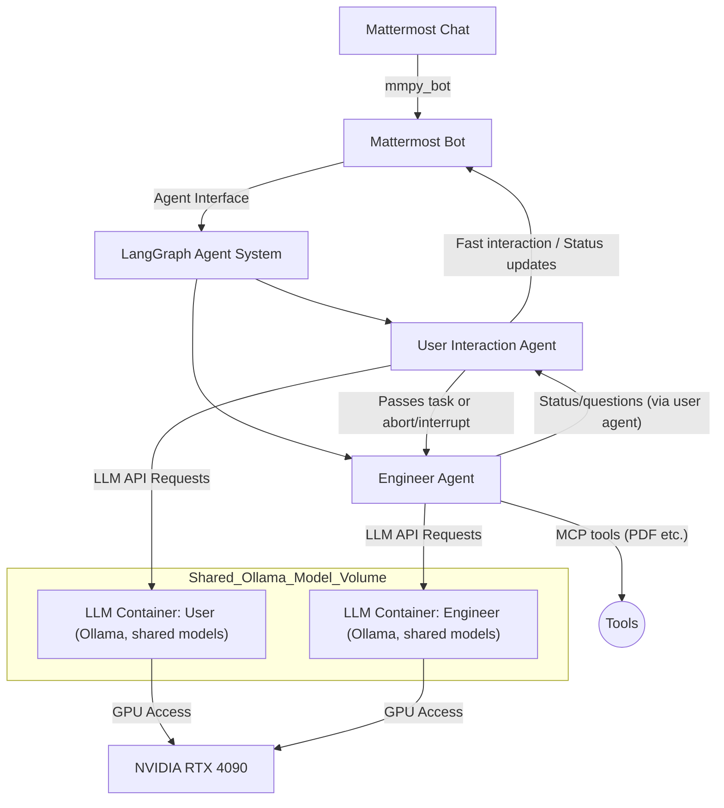

Absolutely! Below is the **updated README.md** reflecting your new requirements:

- **Use [`mmpy_bot`](https://github.com/attzonko/mmpy_bot) as the Mattermost bot Python framework.**
- **Use Ollama for the LLM containers.**
- **Downloaded Ollama models are stored in a shared volume and mounted to each LLM container to support reuse.**

---

# Mattermost LangGraph Agent System

## Table of Contents

- [Overview](#overview)
- [Architecture](#architecture)
- [Repository Structure](#repository-structure)
- [Prerequisites](#prerequisites)
- [Setup Guide](#setup-guide)
- [Configuration](#configuration)
- [Running the System](#running-the-system)
- [Development Status](#development-status)
- [License](#license)

---

## Overview

This repository implements an advanced multi-layered AI-agent system for seamless user interaction and LLM-based engineering tasks, interfacing with Mattermost as the primary chat frontend.

It leverages:
- **Mattermost Bot (Python via `mmpy_bot`):** Bridges user conversations from Mattermost chat to the agent system.
- **LangGraph Agent System:** Multi-agent orchestrator (user-interaction and engineer agents) for optimized conversational and task work.
- **LLM Docker Containers (Ollama):** GPU-accelerated language models exposed via the OpenAI API for high-performance NLP, with models stored in a shared directory to avoid duplication.

> **NOTE:** Mattermost instance is considered up and running externally—this repository provides all subsequent layers.

---

## Architecture



---

## Repository Structure

```
/
├── app/
│   ├── main.py                # Python app entrypoint (Mattermost <-> LangGraph)
│   ├── bot/
│   │   └── mattermost_bot.py  # Mattermost bot integration (using mmpy_bot)
│   └── agents/
│       ├── user_agent.py      # User interaction agent logic
│       ├── engineer_agent.py  # Engineer "thinking" agent logic
│       └── agent_system.py    # LangGraph agent orchestrator
├── tools/
│   └── pdf_processor.py       # MCP tool example: PDF processing
├── llm/
│   ├── Dockerfile.user        # Dockerfile for user LLM (Ollama)
│   ├── Dockerfile.engineer    # Dockerfile for engineer LLM (Ollama)
│   ├── run_user.sh            # Launch user LLM container (bind to shared volume)
│   └── run_engineer.sh        # Launch engineer LLM container (bind to shared volume)
├── infra/
│   └── setup_nvidia_docker.sh # Script to setup Docker/NVIDIA support, and create shared Ollama model dir
├── llm_models/                # Shared Ollama models directory for all containers (bind mounted)
├── docker-compose.yml         # Compose file to manage containers and shared volume
├── requirements.txt           # Python dependencies (incl. mmpy_bot)
├── README.md                  # (This file)
└── .env.example               # Environment variable template
```

---

## Prerequisites

- Ubuntu 20.04+ with NVIDIA RTX 4090
- [Docker](https://docs.docker.com/engine/install/ubuntu/)
- [NVIDIA Docker toolkit](https://docs.nvidia.com/datacenter/cloud-native/container-toolkit/install-guide.html)
- Python 3.10+
- Access to a running Mattermost instance (URL/token supplied via `.env`)
- (Optional) [docker-compose](https://docs.docker.com/compose/)

---

## Setup Guide

### 1. Prepare NVIDIA, Docker, and Shared Model Volume

```bash
cd infra
chmod +x setup_nvidia_docker.sh
sudo ./setup_nvidia_docker.sh
```
- This script installs NVIDIA Docker support and creates `../llm_models/` for model downloads.  
  All LLM containers mount this directory for model sharing.

### 2. Clone Repository

```bash
git clone <this-repo-url>
cd <this-repo-name>
```

### 3. Configure Environment Variables

- Copy `.env.example` to `.env`
- Edit `.env` for Mattermost tokens, LLM endpoints, etc.

### 4. Build & Launch LLM Docker Containers (with Shared Models)

#### Using individual scripts:

```bash
cd llm
chmod +x run_user.sh
chmod +x run_engineer.sh
./run_user.sh
./run_engineer.sh
```

#### Using Docker Compose (Recommended):

```bash
docker-compose up -d
```

- The `docker-compose.yml` mounts the `llm_models/` host directory into each Ollama container as `/ollama/models`, so models are only downloaded once and shared.

#### Ollama Model Download

- During container startup, the required Ollama models (configured in `Dockerfile` or via entrypoint) are downloaded to the shared `/ollama/models` location.
- To pre-fetch specific models manually, run:
  ```bash
  ollama pull <model-name>
  ```
  inside any container or on the host, pointing to the mounted directory.

### 5. Python App Installation

```bash
python3 -m venv venv
source venv/bin/activate
pip install -r requirements.txt
```
- This will also install `mmpy_bot` and all other dependencies.

---

## Configuration

- **Mattermost Bot:** Uses `mmpy_bot`. Set bot token, team, and channel IDs in `.env`.
- **LangGraph Agent System:** See `app/agents/agent_system.py` for logic.
- **Ollama LLM Containers:** Expose OpenAI-compatible REST API on different ports (e.g., user agent on `localhost:8001`, engineer on `localhost:8002`). Update ports in `docker-compose.yml` as needed.
- **Ollama Model Sharing:** All LLM containers mount the same `llm_models/` directory on your host, ensuring only one download per model file for all agents.
- **Tools:** Extend in `tools/`.

---

## Running the System

1. Make sure all containers are running (`docker ps`).
2. Start the Python app:
   ```bash
   cd app
   python main.py
   ```
   The Mattermost bot (powered by `mmpy_bot`) will connect, and routing logic will orchestrate the conversation with LangGraph and the LLMs.

3. Interact via Mattermost. The user agent will keep you informed and communicate with background agents as described.

---

## Development Status

❗ This repository serves as a reference implementation.  
Adapt Ollama models, expand tool integrations, or fine-tune agent logic for production workloads as needed.

---

## License

[MIT](LICENSE)

---

## Acknowledgments

- [Mattermost](https://mattermost.com/)
- [`mmpy_bot`](https://github.com/attzonko/mmpy_bot)
- [LangGraph]
- [Ollama](https://ollama.com/)
- [OpenAI API Specification]

---

**For questions and enhancements, please open an issue or contribute a PR!**

---

**END OF README.md**

---

**Instructions to Coding Agent:**  
Develop code, scripts, and Dockerfiles in accordance with the above structure.  
- Use `mmpy_bot` as the Mattermost integration framework in Python.  
- Use the latest official Ollama image in LLM containers, with the shared `llm_models/` volume.  
- Download required Ollama models into the shared directory during container build or startup.  
- Ensure each LLM instance exposes the OpenAI-compatible API on its own port for use by the agent system.